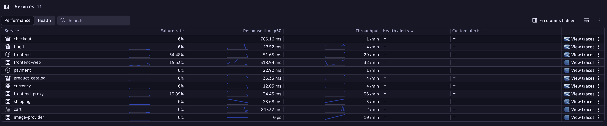

---
# Runme needs this so that it navigates up one dir to teh root
# to search properly for files.
cwd: ..
---

## Query and View Observability Data

In Dynatrace, press `Cmd + k` and search for `Services`.

You should see services (powered by span data) populated on the Services screen.

Press `Cmd + k` again and search for `Distributed Tracing`.

You should see the distributed traces from the OTEL demo.

It's also possible to query span data via [Dynatrace Query Language (DQL)](https://docs.dynatrace.com/docs/platform/grail/dynatrace-query-language){target=_blank}

Press `Cmd + k` again and search for `Notebooks`.

Create a new notebook and add a new section exploring the logs.

Add a new section and choose `Query Grail`. This section type allows you to write your own Dynatrace Query Language (DQL) to have full control over the data you retrieve.

Type: `fetch spans` in the DQL box and execute the query.

## [Click Here to Cleanup resources...](cleanup.md)
